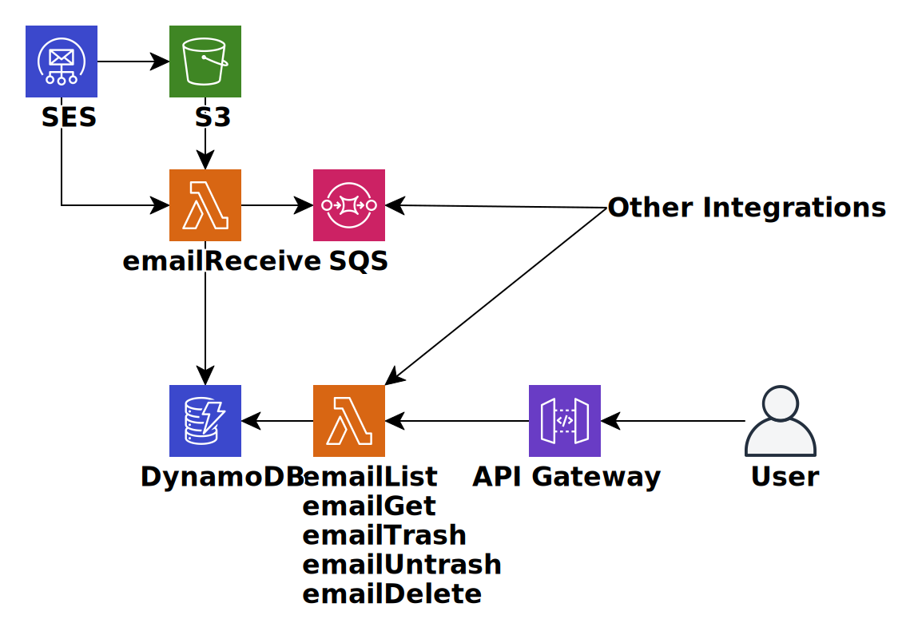

# Mailbox

[](https://github.com/harryzcy/mailbox/actions)
[](https://codecov.io/gh/harryzcy/mailbox)
[](https://goreportcard.com/report/github.com/harryzcy/mailbox)
[](https://opensource.org/licenses/MIT)

Mailbox is an AWS-native email backend for receiving, storing, indexing, and accessing email through a web UI, CLI, and API.

Docs: [English](README.md) • [简体中文](README_zh.md)

## Table of Contents
- [What Mailbox Includes](#what-mailbox-includes)
- [Architecture](#architecture)
- [Quick Start](#quick-start)
- [Clients](#clients)
- [API](#api)
- [Project Structure](#project-structure)
- [Development](#development)
- [Contributing](#contributing)
- [License](#license)

## What Mailbox Includes
- **Email ingestion on AWS** with SES, Lambda, S3, DynamoDB, API Gateway, and optional SQS.
- **Multiple access layers** through the companion web client and CLI.
- **Infrastructure as code** for repeatable deployment and teardown.
- **Go implementation** with tests, coverage, and generated API docs.

## Architecture
Mailbox runs on AWS services including SES, Lambda, API Gateway, DynamoDB, S3, and optional SQS.



## Quick Start

### Prerequisites
- Go 1.25+
- Node.js and npm (for Serverless CLI)
- AWS account with SES enabled in your target region
- [Serverless Framework v3](https://github.com/serverless/serverless)

### 1. Clone the repository
```bash
git clone https://github.com/harryzcy/mailbox.git
cd mailbox
```

### 2. Install dependencies
```bash
npm install -g serverless@v3
```

### 3. Configure AWS credentials
Create an IAM user with access to the required AWS resources, then export credentials:

```bash
export AWS_ACCESS_KEY_ID=<your-key>
export AWS_SECRET_ACCESS_KEY=<your-secret>
```

### 4. Prepare infrastructure config
Create the required S3 bucket, enable SES receiving, and optionally create an SQS queue.
Then copy the example configuration:

```bash
cp serverless.yml.example serverless.yml
```

Update `provider.environment` with your values for `REGION`, `S3_BUCKET`, and optional `SQS_QUEUE`.

### 5. Deploy
```bash
make deploy
```

### 6. Enable inbound email routing
In the AWS console, create an SES receipt rule with these actions:
1. Deliver incoming mail to your S3 bucket.
2. Invoke the deployed Lambda function, for example `mailbox-dev-emailReceive` or `mailbox-prod-emailReceive`.

## Clients
### Web
Use the companion UI: [mailbox-browser](https://github.com/harryzcy/mailbox-browser)

| Dark mode | Light mode |
|:--:|:--:|
|  |  |

### CLI
```bash
go install github.com/harryzcy/mailbox-cli@latest
```

More details: [mailbox-cli](https://github.com/harryzcy/mailbox-cli)

## API
API reference: [doc/api.md](doc/api.md)

## Project Structure
```text
.
├── doc/                 # API docs and architecture diagram
├── integration/         # integration tests
├── script/              # build and download helpers
├── main.tf              # Terraform resources
├── serverless.yml.example
└── Makefile             # build, deploy, remove, test
```

## Development
Run tests locally:

```bash
make test
```

Useful commands:

```bash
make build
make build-deploy
make remove
```

## Contributing
Issues and pull requests are welcome. For local development, use Go 1.25+ and note that only the two most recent Go minor versions are officially supported.

## License
Released under the [MIT License](LICENSE).
