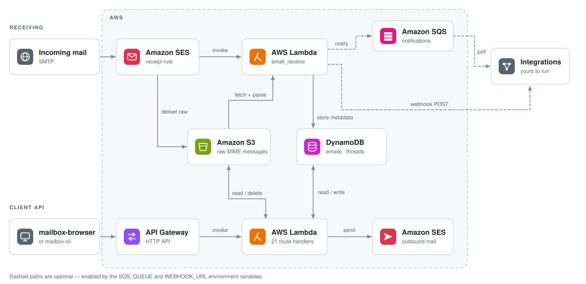

# Mailbox

[](https://github.com/harryzcy/mailbox/actions)
[](https://codecov.io/gh/harryzcy/mailbox)
[](https://goreportcard.com/report/github.com/harryzcy/mailbox)
[](http://makeapullrequest.com)
[](https://opensource.org/licenses/MIT)

Versatile email infrastructure that operates on AWS.

## Clients

### Web

See [mailbox-browser](https://github.com/harryzcy/mailbox-browser)

| Dark mode |  Light mode |
|:---------:|:-----------:|
|  |  |

### CLI

```bash
go install github.com/harryzcy/mailbox-cli
```

For details, refer to [mailbox-cli](https://github.com/harryzcy/mailbox-cli)

## Deploy

Deployment is managed with [Terraform](https://developer.hashicorp.com/terraform).

### Prerequisites

Two S3 buckets are created outside Terraform, because one must exist before
`terraform init` can run and the other holds mail that must outlive any stack:

- **A state bucket**, for Terraform state. Enable versioning so a bad write can
  be rolled back.
- **An email bucket**, where SES delivers raw messages.

### Credentials

The provider sets only a region, so Terraform uses the standard AWS credential
chain: environment variables, a named profile, or IAM Identity Center.

Deploying needs write access to IAM, Lambda, API Gateway, CloudWatch Logs, SQS,
Signer, SES, the state bucket, and — unless `aws_dynamodb_table_override` is set
— DynamoDB. It also needs `iam:PassRole` for the Lambda execution role, which is
easy to miss because the resulting error names `CreateFunction` instead.

Attach those permissions to a role and assume it, rather than granting them to a
user directly:

```ini
# ~/.aws/config
[profile mailbox]
role_arn = arn:aws:iam::<account-id>:role/mailbox-deploy
source_profile = default
region = us-west-2
```

```shell
AWS_PROFILE=mailbox make apply
```

With IAM Identity Center, `aws sso login --profile mailbox` instead — no stored
key at all.

CI does not use any of this. It assumes a short-lived, plan-only role through
GitHub OIDC; see `oidc.tf`.

### Configure

Everything has a working default; the variables below are optional overrides
that each turn a feature on. Set them as `TF_VAR_` environment variables.

| Variable | Purpose |
| --- | --- |
| `aws_region` | Region to deploy into. Defaults to `us-west-2`. |
| `project_name`, `environment` | Name resources. Default to `mailbox-v2` and `dev`. |
| `aws_s3_bucket_override` | Use an existing email bucket instead of `<project>-<env>`. |
| `aws_dynamodb_table_override` | Use an existing table instead of creating one. |
| `aws_dynamodb_point_in_time_recovery` | Continuous backups on the managed table. Defaults to `true`; incurs [additional cost](https://aws.amazon.com/dynamodb/pricing/). |
| `ses_receipt_rule_set_name`, `ses_receipt_rule_name` | Manage an existing SES receipt rule. Both required to enable; otherwise SES is left alone. |
| `github_repository`, `github_oidc_provider_arn` | Create a CI role for that repo. Both required to enable. |

### Deploy

```shell
export TF_STATE_BUCKET=<your-state-bucket>
make init
make deploy
```

`make deploy` fetches the Lambda binaries from the latest release. Use
`make apply` to deploy binaries built from your working tree instead, and
`make plan` to preview without applying.

### Configure email receiving

SES applies **one active receipt rule set per region**, and it may already hold
rules unrelated to this project. Terraform therefore manages a single rule
inside an existing set rather than the set itself.

Create a rule set and a rule with two actions, in this order:

1. **Deliver to S3**, naming your email bucket.
2. **Invoke Lambda**, selecting `<project>-<env>-email_receive`.

Then activate the rule set. To let Terraform manage the rule's Lambda action
from then on, set `ses_receipt_rule_set_name` and `ses_receipt_rule_name` and
import it:

```shell
terraform import 'aws_ses_receipt_rule.receive[0]' <rule-set-name>:<rule-name>
```

Finally, deploy [mailbox-browser](https://github.com/harryzcy/mailbox-browser)
or use [mailbox-cli](https://github.com/harryzcy/mailbox-cli).

## API

See [doc/API.md](doc/api.md)

## Architecture

It runs on AWS services, including SES, Lambda, API Gateway, DynamoDB, and SQS.



## Contributing

### Development environment

- Go >= 1.27

Note that only the most recent minor versions of Go are officially supported.
